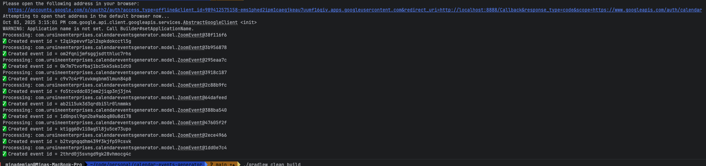

# Google Calendar Events Generator

A Java 23 standalone CLI application that will create recurring weekly Google Calendar events for a specified list of recurring Zoom meetings.

## Prerequisites

1. Java 23 JDK
2. Gradle (or use the included wrapper `./gradlew`)
3. A Google Cloud project with Calendar API enabled
4. OAuth 2.0 client credentials (type "Desktop app") — download `credentials.json` and place it in `src/main/resources/credentials.json`

## Build

### Quick Build
Build the project and create a fat JAR:
```bash
./gradlew clean build shadowJar
```

### Package (Clean + Build + Shadow JAR)
Use the custom `pkg` task to clean, build, and produce the shadow JAR in one command:
```bash
./gradlew pkg
```

The fat JAR will be created at: `build/libs/calendar-events-generator-<version>.jar`

## Run

### Run the Application
```bash
java -Dapp.env=local -jar build/libs/calendar-events-generator-<version>.jar [options]
```

Or for production:
```bash
java -Dapp.env=prod -jar build/libs/calendar-events-generator-<version>.jar [options]
```

### Output

 

### Run with Gradle
```bash
./gradlew run --args="[your-arguments]"
```

## Release Management

### Create a Release
Convert the current SNAPSHOT version to a release version and build the fat JAR:
```bash
./gradlew release
```

This will:
1. Remove `-SNAPSHOT` from the version in `gradle.properties`
2. Build the fat JAR with the release version
3. Output: `build/libs/calendar-events-generator-<release-version>.jar`

### Bump to Next Development Version
After a release, bump to the next SNAPSHOT version:

```bash
# Bump patch version (e.g., 1.0.0 -> 1.0.1-SNAPSHOT)
./gradlew nextSnapshot

# Bump minor version (e.g., 1.0.0 -> 1.1.0-SNAPSHOT)
./gradlew nextSnapshot -Ptype=minor

# Bump major version (e.g., 1.0.0 -> 2.0.0-SNAPSHOT)
./gradlew nextSnapshot -Ptype=major
```

## Development

### Project Configuration
Configuration is managed through `gradle.properties`:
- `version`: Current project version
- `group`: Maven group ID
- `mainClass`: Application entry point
- `description`: Project description

### Dependencies
- **Lombok 1.18.36**: For boilerplate code reduction
- **Google Calendar API**: For calendar integration
- **Jackson**: For JSON processing
- **SLF4J**: For logging

### Build Information
The shadow JAR includes metadata in its manifest:
- Implementation version
- Build timestamp
- Git commit hash
